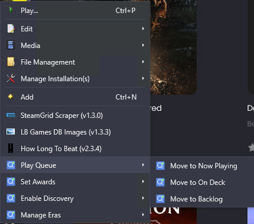

# QuickFieldToggle

[](LICENSE)
[](https://www.launchbox-app.com/)
[](https://github.com/brandontravis/launchbox-quick-field-toggle/releases)
[](https://www.launchbox-app.com/)

A powerful LaunchBox plugin for rapidly managing custom fields via the right-click context menu.

> **Compatibility:** Tested on LaunchBox 13.24 (Windows). Other versions may work but are untested.



---

## The Problem

If you use custom fields to organize your LaunchBox library—tracking backlogs, tagging award winners, marking "now playing" games—you know the pain:

**Right-click → Edit → Custom Fields tab → scroll → find field → change value → OK → repeat for next game...**

It's tedious. Especially when you're going through your library tagging games or managing a play queue. What should be a one-click action becomes a multi-step ordeal.

## The Solution

**QuickFieldToggle** puts your custom field actions directly in the right-click context menu. One click. Done.

---

## Why I Built This

I maintain a large LaunchBox library with extensive custom field usage:

- **Play Queue** - Tracking what I'm playing, what's on deck, and my backlog
- **Awards** - Tagging games with GOTY wins, nominations, and other accolades
- **Discovery Features** - Flagging games for my "discovery bin" rotation
- **Platform-Specific Data** - First-party titles, Virtual Console releases, mini console appearances

Managing all of this through the Edit dialog was slow and frustrating. I wanted the same kind of quick-toggle experience you get with favorites (the star), but for ANY custom field.

QuickFieldToggle is the result.

---

## ✨ Features

- **⚡ Single-click field toggling** - No more Edit → Custom Fields → scroll → save
- **✓ Visual status indicators** - Checkmarks show current field state
- **🔗 Multi-field actions** - One click can set/remove multiple fields
- **📋 Multi-value picker** - Select from semicolon-separated value lists
- **🎯 Conditional display** - Show/hide items based on platform, genre, etc.
- **🎨 Custom icons** - Platform icons, playlist icons, or custom images
- **🔄 Hot reload** - Update config without restarting LaunchBox
- **📝 JSON configuration** - No recompilation needed

---

## Use Cases

### Play Queue Management

Create mutually exclusive states: "Move to Now Playing" sets the Now Playing field AND removes Backlog and On Deck. One click, three field changes.

### Award Tracking

Semicolon-separated field values become checkable submenus. See all awards in your library, check the ones that apply to this game.

### Platform-Specific Tools

Show "First Party" toggle only for Nintendo games. Show "PSN Classic" only for PlayStation. The menu adapts to what you're looking at.

### Bulk Tagging

Select 50 games, right-click, toggle a field. All 50 updated instantly.

---

## 📦 Installation

1. Download the [latest release](https://github.com/brandontravis/launchbox-quick-field-toggle/releases/latest)
2. Extract to `LaunchBox\Plugins\`:
   ```
   Plugins\
   ├── QuickFieldToggle.dll
   └── quickfieldtoggle.json  (rename from .sample.json)
   ```
3. Restart LaunchBox
4. Right-click any game → See your new menu options!

> **Windows Security:** If the plugin doesn't load, right-click the DLL → Properties → Unblock

## 🚀 Quick Start

Rename `quickfieldtoggle.sample.json` to `quickfieldtoggle.json` for a working demo with **On Deck** and **Backlog** fields.

---

## 💡 Example Configuration

```json
{
  "groups": [
    {
      "groupName": "Play Queue",
      "icon": "default",
      "iconCascade": "inherit",
      "items": [
        {
          "fieldName": "Now Playing",
          "menuLabel": "Move to Now Playing",
          "operationType": "set",
          "additionalActions": [
            { "field": "Backlog", "action": "remove" }
          ]
        }
      ]
    }
  ]
}
```

---

## 📖 Documentation

See the [**Configuration Guide**](docs/CONFIGURATION.md) for complete setup instructions with examples.

**Jump to:**
- [Simple Toggles](docs/CONFIGURATION.md#simple-toggles)
- [Action Menus](docs/CONFIGURATION.md#action-menus-move-to-backlog)
- [Multi-Value Picker](docs/CONFIGURATION.md#multi-value-picker)
- [Conditional Display](docs/CONFIGURATION.md#conditional-display)
- [Icons](docs/CONFIGURATION.md#icons)

---

## Design Philosophy

### Configuration Over Code

Everything is controlled via a JSON file. No recompilation needed. Want to add a new toggle? Edit the JSON. Want to reorganize your menus? Edit the JSON.

### Smart Defaults, Full Control

The plugin tries to do the right thing automatically:
- Checkmarks show current state
- Multi-select works intelligently (set on all if mixed, remove from all if unanimous)
- Icons inherit from parent groups

But you can override any behavior when needed.

### Respect the User's Setup

- Uses your active Platform Icon pack
- Reads LaunchBox settings for consistency
- Hot reload means no restarts required

---

## 📁 Repository Structure

```
QuickFieldToggle/
├── LICENSE
├── README.md                    ← You are here
├── assets/                      ← Screenshots
│   └── screenshot.png
├── docs/                        ← Documentation
│   └── CONFIGURATION.md         ← Complete config guide
├── dist/                        ← Release packages
│   └── QuickFieldToggle_v1.0.0.zip
└── src/                         ← Source code
    ├── QuickFieldToggle.csproj
    ├── QuickFieldTogglePlugin.cs
    ├── quickfieldtoggle.sample.json
    └── quickfieldtoggle.sample.robust.json
```

## 🤝 Contributing

Contributions welcome! Feel free to:
- Report bugs
- Suggest features
- Submit pull requests

## 📄 License

[MIT License](LICENSE) - Free to use, modify, and distribute.

## 🙏 Credits

Developed for the LaunchBox community.

---

**[⬇️ Download Latest Release](https://github.com/brandontravis/launchbox-quick-field-toggle/releases/latest)**
